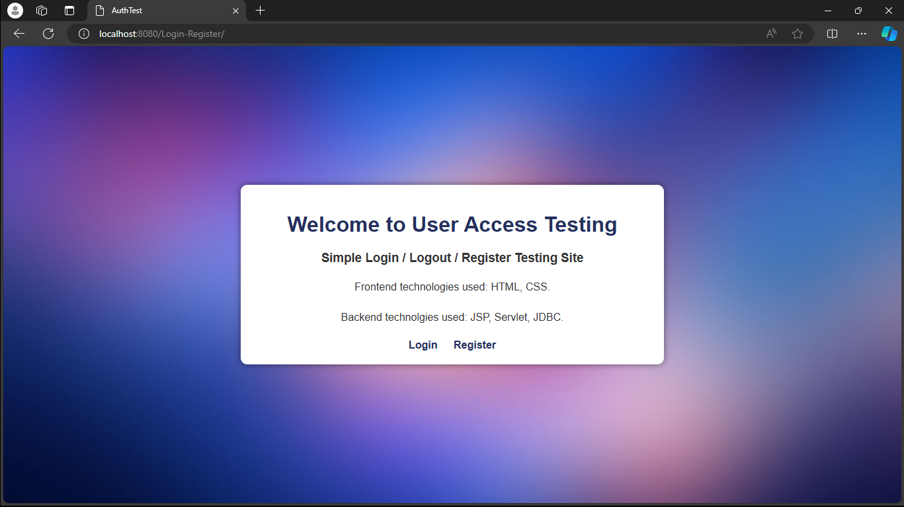
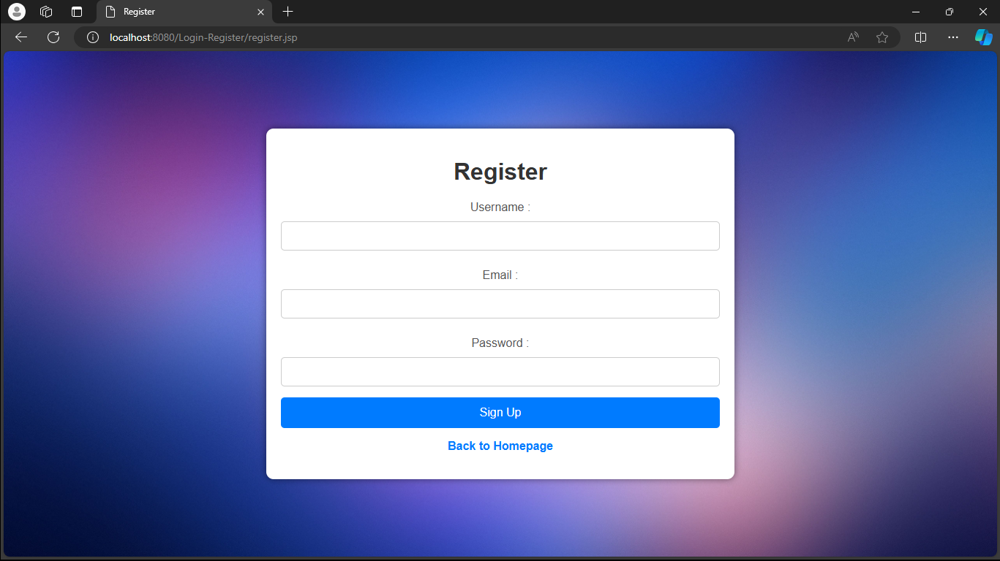
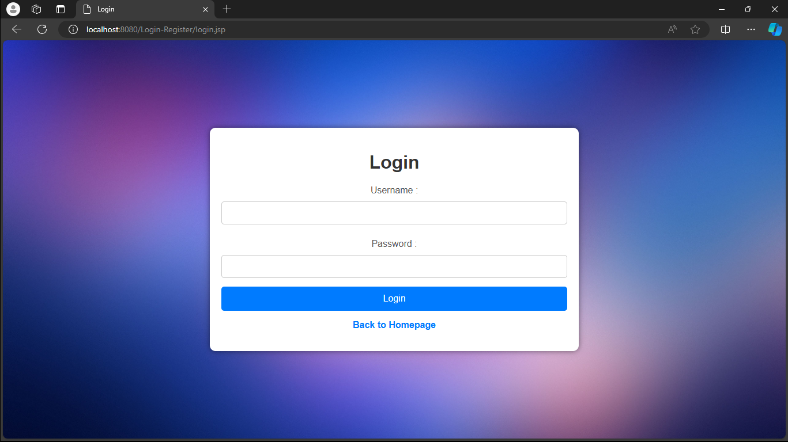
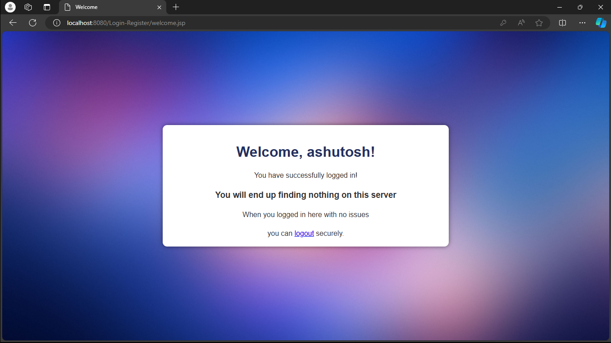

# Register-Login-Logout Project in Java

Welcome to the Register-Login-Logout project! This project demonstrates a simple web application for user registration, login, and logout using Java. The application leverages JSP, Servlets, Apache Tomcat, Java I/O, and includes HTML and CSS for the frontend.

## Introduction

This project is aimed at beginners who want to understand how to build a simple web application using Java. By following this project, you will learn how to:

- Set up a Java web application environment
- Use JSP and Servlets for web development
- Handle user input and sessions
- Utilize Java I/O for reading and writing data
- Implement basic authentication
- Style the frontend using HTML and CSS

## Features

- User registration with basic form validation
- User login with session management
- User logout functionality
- Simple and responsive UI

## Technologies Used

- Java
- JSP (JavaServer Pages)
- Servlets
- Apache Tomcat Server
- MySQL
- HTML
- CSS

## Installation

To set up the project on your local machine, follow these steps:

1. **Clone the repository:**

    ```bash
    git clone https://github.com/ashutoshh-17/register-login-logout.git
    ```

2. **Navigate to the project directory:**

    ```bash
    cd register-login-logout
    ```

3. **Open the project in your preferred IDE (e.g., IntelliJ IDEA, Eclipse):**

    - Import the project as a Maven or Java EE project if you're using a build tool.
    - Alternatively, you can create a new Dynamic Web Project and add the source files manually.

4. **Set up Apache Tomcat:**

    - Download and install [Apache Tomcat](http://tomcat.apache.org/).
    - Configure Tomcat in your IDE.

5. **Deploy the project on Tomcat:**

    - Right-click on the project and choose "Run on Server".
    - Select Apache Tomcat and finish the setup.

6. **Set up the Database:**

    - Install MySQL or any other SQL database.
    - Create a database and a user table using the provided SQL script.

## SQL Script

```sql
CREATE DATABASE user_db;

USE user_db;

CREATE TABLE users (
    id INT AUTO_INCREMENT PRIMARY KEY,
    username VARCHAR(50) NOT NULL UNIQUE,
    password VARCHAR(50) NOT NULL
);
```      

## Usage

To run the Register-Login-Logout application:

1. **Start the Apache Tomcat server from your IDE.**

2. **Access the application in your web browser:**

    ```bash
    http://localhost:8080/Login-Register/index.html
    ```

3. **Register a new user:**

    - Fill out the registration form and submit.

4. **Login with the registered user credentials:**

    - Enter your username and password and click "Login".

5. **Logout:**

    - Click the "Logout" button to end the session.

## Project Structure

The project structure is as follows:

```
register-login-logout/
├── src/
│   ├── main/
│   │   ├── java/
│   │   │   ├── com.company.servlet/
│   │   │   │   ├── LoginServlet.java
│   │   │   │   └── RegisterServlet.java
│   │   │   ├── com.company.dao/
│   │   │   │   └── User.java
│   │   │   │   └── UserDao.java
│   │   │   │   └── UserDaoImp.java
│   │   │   ├── com.company.util/
│   │   │   │   └── DBUtil.java
│   │   ├── webapp/
│   │       ├── WEB-INF/
│   │       │   └── web.xml
│   │       ├── css/
│   │       │   └── styles.css
│   │       ├── index.jsp
│   │       ├── login.jsp
│   │       ├── register.jsp
│   │       └── welcome.jsp
├── README.md
```

- **LoginServlet.java:** Handles user login requests.
- **LogoutServlet.java:** Manages user logout and session termination.
- **RegisterServlet.java:** Processes user registration.
- **User.java:** Represents the user model.
- **UserIO.java:** Utility class for reading and writing user data.
- **web.xml:** Configuration file for the web application.
- **styles.css:** Stylesheet for the application.
- **index.jsp, login.jsp, register.jsp, welcome.jsp:** JSP files for the web pages.

## Screenshots

Here are some screenshots of the application:

<p align="center">
  
  
  
  
</p>

## Contributing

Contributions are welcome! If you have any suggestions or improvements, feel free to submit a pull request. Please ensure your changes do not break the existing code and include a detailed description of the modifications.

## Contact

If you have any questions or feedback, feel free to contact me

Thank you for using the Register-Login-Logout project! Happy coding!
